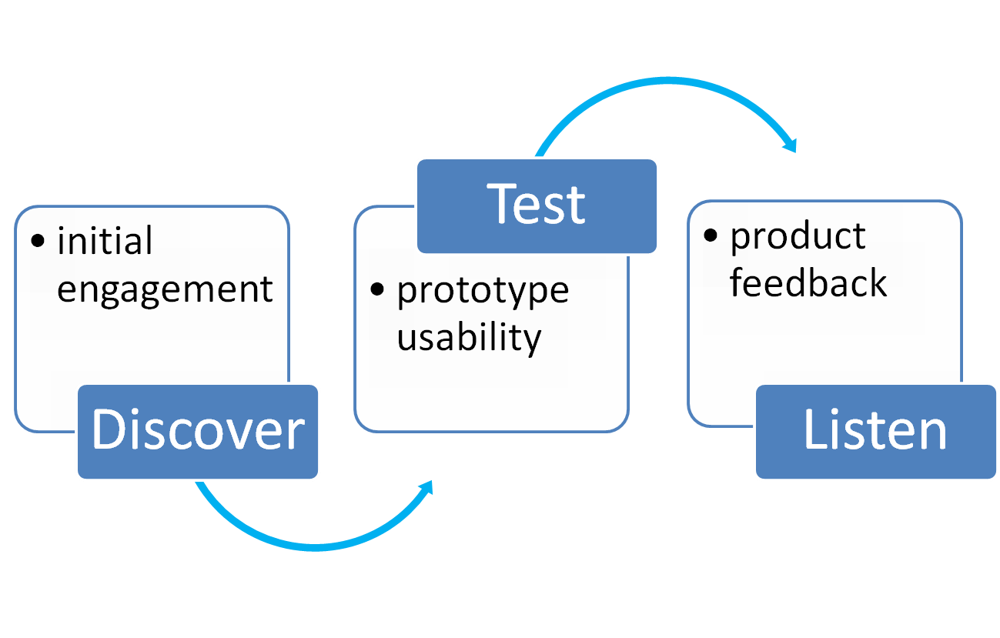
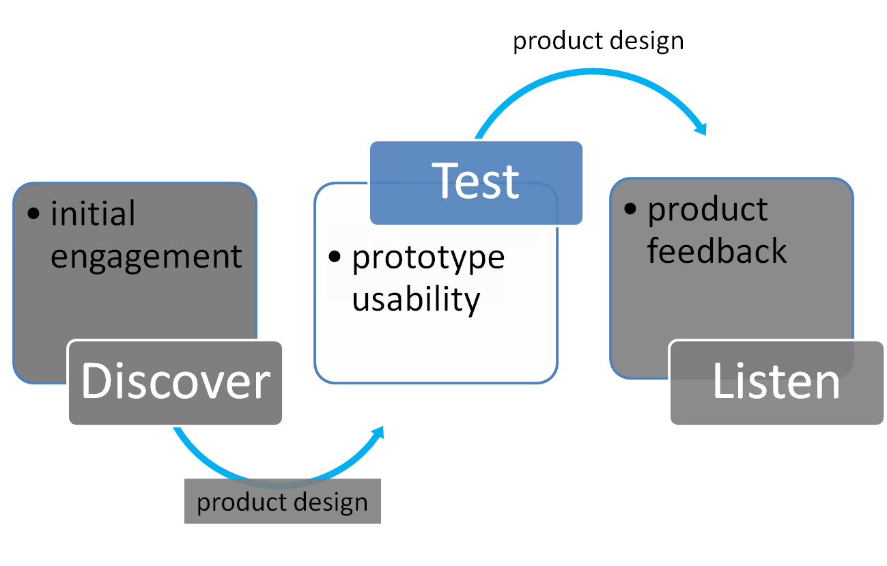

```{r setup, include = FALSE}
# Load packages required
library(knitr)

knitr::opts_chunk$set(echo = FALSE)
```


## Why do Usability Testing?

<p class="comment">
"From the moment you know enough to talk about a product—any product, whether it's hardware, software, a video game, a training guide, or a website—you know too much to be able to tell if the product would be usable for a person who doesn't know what you know."
</p>

<p style="text-align: right"> <a href="https://books.google.co.uk/books/about/Usability_Testing_Essentials.html?id=tzX3J81MAAMC&redir_esc=y">- Carol M.Barnum, Usability Testing and Essentials, 2010</a></p>


## User Research Process

```{r out.width = "90%", fig.align = 'center'}

```


## User Research Process

```{r out.width = "90%", fig.align = 'center'}

```


## What is Usability Testing?

- Usability testing is designed to help diagnose and fix problems with prototypes of a software product (e.g. a shiny app) to determine whether the product is **usable**.

- It is undertaken during the development process, not after release.

- It is also a useful opportunity to assess the efficiency of, and user satisfaction with, a product.


## How does it work?


## The Purpose of Usability Testing

The main purpose of usability testing is not:

- To gain content ideas
- To provide a demonstration of the prototype
- To seek validation for your work


## Links

Email: [jack.hannah1@nhs.net](mailto:jack.hannah1@nhs.net)


[ISD Paper on Usability Testing](https://www.isdscotland.org/About-ISD/Methodologies/_docs/Usability-Testing-v1-0.pdf)


[ISD Paper on Initial User Engagement](https://www.isdscotland.org/About-ISD/Methodologies/_docs/Initial-User-Engagement-v1-2.pdf)


[Transforming Publishing on GitHub](https://github.com/NHS-NSS-transforming-publications)


[PHI on GitHub](https://github.com/Health-SocialCare-Scotland)