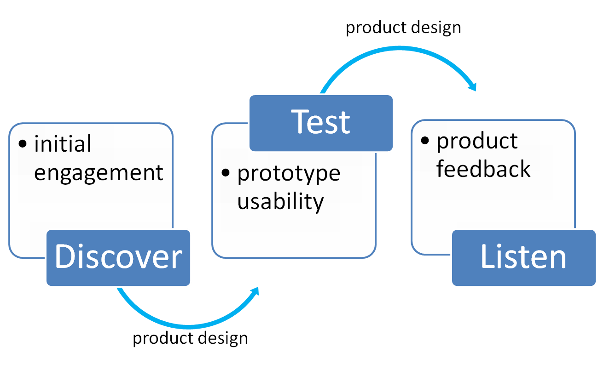

```{r setup, include = FALSE}
# Load packages required
library(knitr)
library(magrittr)
library(kableExtra)

knitr::opts_chunk$set(echo = FALSE)
```


## Why do User Research & Usability Testing?

<p class="comment">
"Users of statistics and data should be at the centre of statistical production; their needs should be understood, their views sought and acted upon, and their use of statistics supported."
</p>

<p style="text-align: right"> <a href="https://www.statisticsauthority.gov.uk/wp-content/uploads/2018/02/Code-of-Practice-for-Statistics.pdf">- UKSA Code of Practice for Statistics, 2018</a></p>


## User Research Process

```{r out.width = "90%", fig.align = 'center'}

```


## Initial Engagement

- Method (e.g. Focus groups, interviews, survey)


- Design (Goals, objectives, questions)


- Participant recruitment (Who, why, and how?)


- Implementation (Where, when, what with?)


